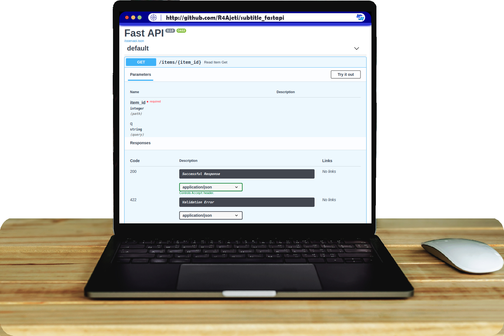

# Backend Development

### Descriptions
> All in One pack from development to docker image! \
Modern API constructor that helps developers to interact with back-end services \
Modern database: Super fast response (on query search time computation O(1)), high performance (with horizontal scaling) and reliable source (with triple validation processes Client + API + Server) \
Unit testing with at least 75% of coverage, furthermore end-to-end testing 100% of it's coverage \
Simple client-side response (Front-END)

#### Generated API Reference Documentation App Screenshots

<table>
  <tr>
    <td align="center">Django Openapi Swagger UI</td>
     <td align="center">Fastapi Openapi Swagger UI</td>
  </tr>
  <tr>
    <td></td>
    <td></td>
  </tr>
 </table>

> All tool essential, primary choice built with it's initial release date are greater than year 2018 except git, python3 and django \
Based on [CAP theorem](https://en.wikipedia.org/wiki/CAP_theorem) an database that chooses Partition Tolerance first then Availability or Consistency secound (second depends on your choice) \
Free installation for static client-side web page, free/paid template or configuration of well-documented client-side web app

### Built With

- [Python3](https://www.python.org/downloads/) - IRD 2008 - Interpreter language
- [Django](https://www.djangoproject.com/download/) - IRD 2005 - The model–template–views architectural pattern web framework  or!
-   - [Flask](https://flask.palletsprojects.com/en/2.0.x/installation/) - IRD 2010 -  Small and easy-to-extend core web framework
-   - [FastAPI](https://fastapi.tiangolo.com/) -  IRD 2018 - Modern, fast/high execute performance, web framework
-  - [custom](#) - Any other similar choice as web framework

-  [Swagger](https://data.nav.no/digdir-api/docs) - IRD 2011 - OpenAPI/Swagger-generated API Reference Documentation  or!
-  - [Redoc](https://github.com/Redocly/redoc) - IRD 2020 - Reinvented OpenAPI/Swagger-generated API Reference Documentation
-  - [custom](#) - Any other similar choice as generated API reference documentation, based on web framework chosen

-  [FireO](https://octabyte.io/FireO/quick-start/) - IRD 2019 - A modern and simplest convenient ORM package in Python  or!
-  - [FirestoreORM](https://pypi.org/project/firestore-orm/) - IRD 2019 - A module that adds support for firestore Object Relational Mapping to your application
-  - [FirebaseORM](https://pypi.org/project/firebase-orm/) - IRD 2018 - Django like models for NoSQL database Firestore
-  - [custom](#) - Any other similar choice as non-sql db orm, based on no-sql type db chosen
- [FireStore](https://firebase.google.com/docs/firestore) - IRD 2019 - Cloud-hosted NoSQL document database that lets you easily store, sync, and query data for your mobile and web apps - at global scale  or!
-  - [FireBaseRealtimeDB](https://firebase.google.com/docs/database) - IRD 2012 - Cloud-hosted NoSQL database that lets you store and sync data between your users in realtime.
-  - [DynamoDB](https://aws.amazon.com/dynamodb/) - IRD 2019 - Cloud-hosted fast and flexible NoSQL key–value pair database service for any scale
-  - [custom](#) - Any other similar choice as nonsql cloud-hosted or server-hosted db

- [GitHub](https://github.com/) - IRD 2008 - Cloud-distributed version control and source code management functionality  or!
-  - [BitBucket](https://bitbucket.org/product) - IRD 2012 - Git-based source code repository hosting
-  - [custom](#) - Any other similar choice as cloud-distributed version control

- [Shell/Bash](https://en.wikipedia.org/wiki/Unix_shell) - IRD 1989 - A computer program designed to be run by the Unix shell, a command-line interpreter  or!
-  - [custom](#) - Any other similar choice as a script helper between docker container and kernel or os img (like cloud shell in GCP AWS or AZURE)
-  [Pytest](https://pypi.org/project/pytest) - IRD 2010 - Framework makes it easy to write small tests, yet scales to support complex functional testing for applications and libraries
-  [Selenium](https://pypi.org/project/selenium/) - IRD 2008 - Run web automation tests with ease. ... to the front end, they need to run appropriate cross browser tests
-  [Docker](https://docs.docker.com/engine/reference/commandline/config/) - IRD 2013 - A set of platform as a service products that use OS-level virtualization to deliver software in packages called containers

### Live Demo

- [DEMO](#)

### Getting Started

Setup and Installation without including environment variables

- i. INSTALL GIT and python in your MACHINE | Dowload git from here lastest version [Git](https://git-scm.com/downloads) and [python](https://www.python.org/downloads/)
- ii. Install venv on python by running on terminal/cmd | 'pip install virtualenv'
- iii. Open in terminal/cmd folder path where wana clone/install this library
- iv. Create virtual enviroment using interpreter python v3 | 'python -m venv env'
- v. Activate enviroment by running on terminal/cmd | '.\env\Script\activate'

### Instruction to run the code

To get a local copy up and running follow these simple example steps.

ON LINUX MACHINE:
- i. Open Terminal | Go to the dir that you wana save your files

ON WINDOW MACHINE:
- i. Open Git Bash | Go to the dir that you wana save your files

- ii. Clone One The Repository | Type | 'git clone https://github.com/R4Ajeti/$repo_name'
- iii. Run The Code | Give access to shell script and run shell script:  Type | 'chmod 777 run.sh & ./run.sh'
- iv. Enjoy And Report Bug | Report bug on r4ajeti@gmail.com

### Authors

👤 **Author I**

- Github: [@r4ajeti](https://github.com/r4ajeti)
- Twitter: [@r4ajeti](https://twitter.com/r4ajeti)
- Linkedin: [linkedin](https://www.linkedin.com/in/r4ajeti/)
- Email: [Gmail](mailto:r4ajeti@gmail.com)

###  🤝 Contributing

Contributions, issues and feature requests are welcome!

Feel free to check the [issues page](/../../issues).

### Show your support

Give a ⭐️ if you like this project!

### Acknowledgments

- Hat tip to anyone whose code was used
- Inspiration
- etc

### 📝 License

This project is [MIT](/../../blob/main/LICENSE) licensed.

:¨·.·¨: :¨·.·¨: ·. ƮϦαɳk Ψөu .·

